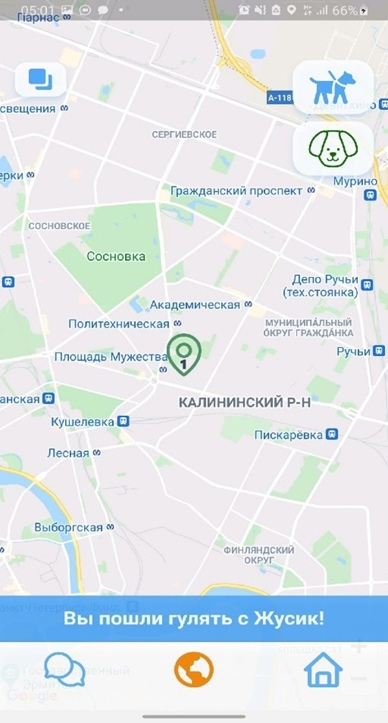
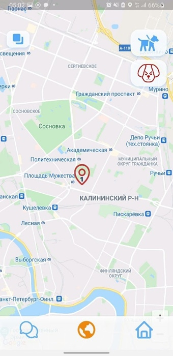
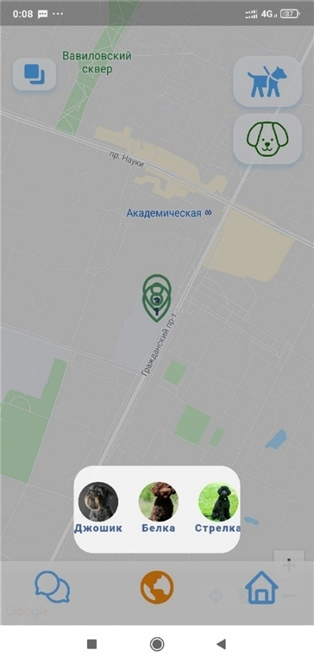
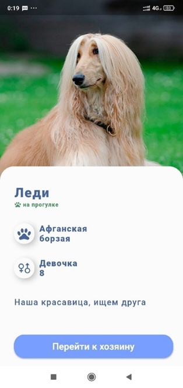
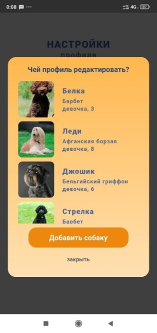
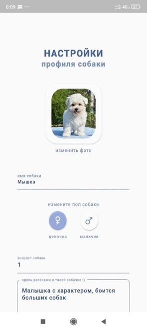

# doggo_app
Мобильное приложение для безопасного выгула собак
***
## Команда
* Белова Мария, гр. 3530202/90201
* Талипова Бэлла, гр. 3530202/90201
* Шевцов Артём, гр. 3530202/90201
* Савенкова Анастасия, гр. 3530202/90201
***
## Проблемы, которые решает проект
1. Случайные нежелательные встречи с другими собаками, представляющими опасность собаке хозяина во время её выгула
2. Кинофобия и неприязнь к собакам
3. Отсутствие информации о желаемой породе в должном объёме в доступных источниках
***
## Скриншоты работы приложения

***
## Тестирование
В этом проекте мы использовали проверку «серого ящика», т. к. тестированием занимались те же люди, что и писали код. Однако мы тестировали не только свой код, но и части приложения, которые писали другие разработчики, не зная о их реализации практически ничего. И так, тестируя код на разных устройствах, в разное время, мы быстро находили ошибки друг друга и передавали их на исправление.
